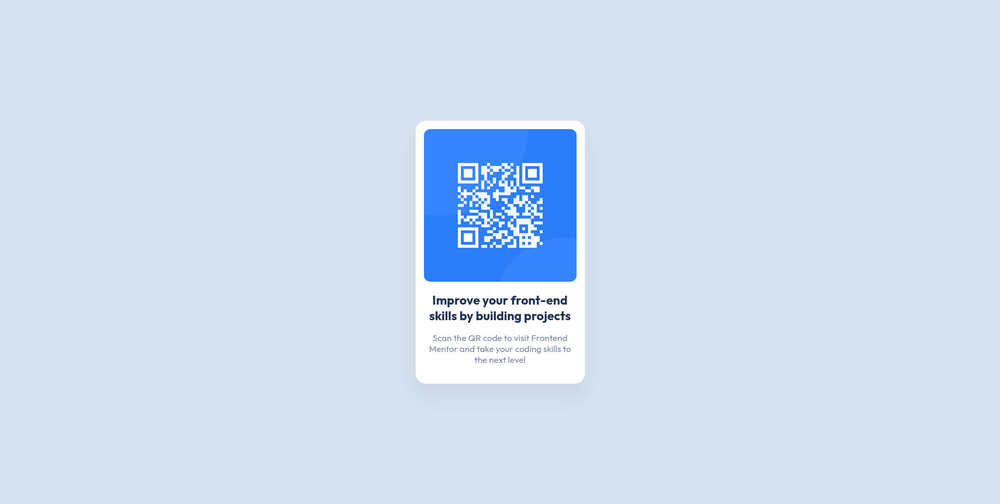

# Frontend Mentor - QR code component solution

This is a solution to the [QR code component challenge on Frontend Mentor](https://www.frontendmentor.io/challenges/qr-code-component-iux_sIO_H). Frontend Mentor challenges help you improve your coding skills by building realistic projects. 

## Table of contents

- [Overview](#overview)
  - [Screenshot](#screenshot)
- [My process](#my-process)
  - [Built with](#built-with)
  - [What I learned](#what-i-learned)
  - [Continued development](#continued-development)
  - [Useful resources](#useful-resources)
- [Author](#author)

Note: English is not my first language, I do my best to provide all the explanation of what I did the best I can.

## Overview
The main objective of this challenge, is to made similar looking webpage to the designs present in the "design folder". You are allowed to use any framework and library you want.    
### Screenshot
This was the final result:


## My process

I started by analizing the desing. I need a container for the image and the text, so i made a div called "container" and put all the other elements inside of it. 
I add a background color for the container and give it some witdh and height, that way I can see the box.
Then I make  some adjusting because the QR code image was very big. 
I centered the container using flexbox. 
Make the color palette, add the main font and add a padding to the container to make some space between all in inner elements.
I played with some values to match the image and the design the best possible way I currently can.
But then I noticed the box has a slightly  shadow at bottom. So I search and play with the values to get a similar look to the one provided in the picture.  

### Built with

- Vanilla HTML5
- Vanilla CSS 
- CSS Flexbox
- Mobile-first workflow

### What I learned

I'm very new to this, but I feel so satisfied when manage how center the main element in the center. No matter if I stretch or expand the window, It keeps in the same height. 

```centering the container element
/*body is the parent of #container, so I apply flexbox to body and centered the main and cross axis, that way, #container gets centered always in the middle of the page*/
 body {
    display: flex;
    justify-content: center;
    align-items: center;  
}

  #container {
    width: 325px;
    height: 505px;
    background-color: var(--White);
  }
```

Another thing I never did was using the box-shadow property and learned how to use it at a very basic level. It was really fun.

```Adding some box-shadow
#container {
    width: 325px;
    height: 505px;
    background-color: var(--White);
    border-radius: 20px;
    padding: 16px;
    box-shadow: 0px 25px 30px rgba(123, 135, 157, .12);

  }
```

### Continued development

For now, I'm satisfied with the final result. Im looking forward to do more exercises. If you found an error or something I miss please tell me. Advice are welcomed too! 

### Useful resources

- [CSS box-shadow Property](https://www.w3schools.com/cssref/css3_pr_box-shadow.php) - This helped me with the box-shadow property. 
- [A complete guide to Flexbox](https://css-tricks.com/snippets/css/a-guide-to-flexbox/) - This is an amazing article help me to understand a little bit more about Flexbox works.


## Author

- Github - [Hiram Mendoza | @OneAlpacaMore](https://github.com/OneAlpacaMore)
- Frontend Mentor - [@OneAlpacaMore](https://www.frontendmentor.io/profile/OneAlpacaMore)
